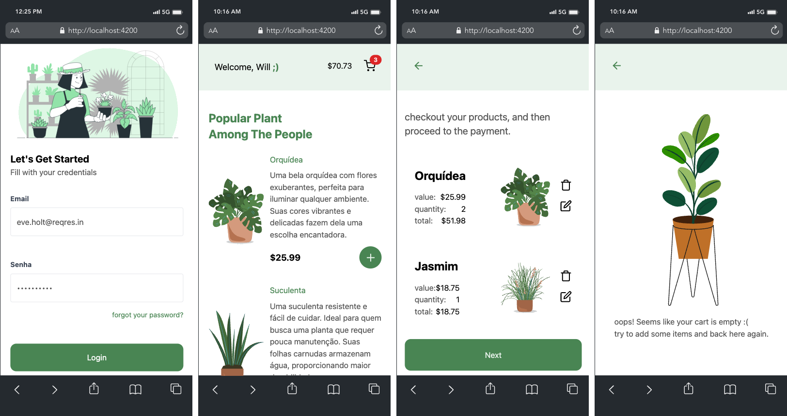
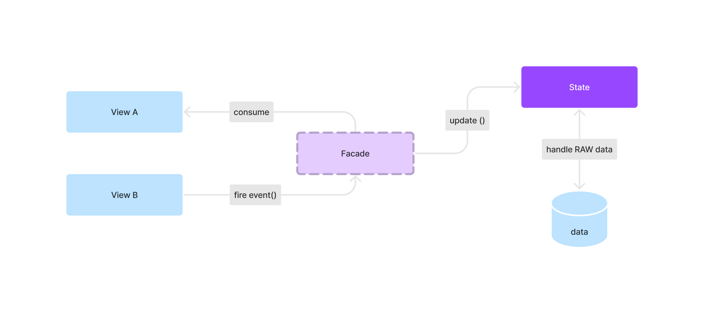

### @ng-shop-workspace

This project servers as a demonstration micro-frontend powered by NX and Module Federation Plugin, this is a simple plant shop, that have features such as recommendation system using AI agents, authentication, cart shop and state management with redux pattern.

<center>
  
</center>

### Table of contents

- [Project Architecture](#project-architecture)
- [Technical Resources](#technical-resources)
- [Getting Started](#getting-started)

### Project Architecture

This project use the [Facade Design Pattern](https://refactoring.guru/design-patterns/facade), with object to simplify state management and abstract the NGXS Store APIs, with that concept
the View layer don't have to know specifics of how the state works and how It's stored. In the image below, you can see how it works.



### Technical Resources

- Recommendation system using AI agents ([StackSpot AI](https://www.stackspot.com/en/))
- Authentication flow with [Reqres.in](https://reqres.in/) integration
- Mono-repo managed by [NX CLI](https://nx.dev/)
- Micro-frontend approach using [Module Federation](https://webpack.js.org/concepts/module-federation/)
- State Management with [NGXS library](https://www.ngxs.io/)
- [Tailwind CSS](https://tailwindcss.com/) for create beautifully, responsive and accessible UI
- [Angular v16.2 | Node 16.x](https://angular.io/) for the micro-frontend apps

### Getting Started

1. Clone this repository

```bash
git clone https://github.com/WillACosta/ng-shop-workspace
```

3. Run the following command

```bash
pnpm install && pnpm bootstrap
```

By executing this command, all the required dependencies will be installed, and the application will be served on `localhost:4200`.

> You can find more information in the `package.json` file
