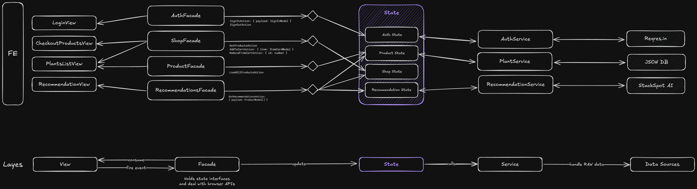

### @ng-shop-workspace

A micro-frontend application powered by NX and Module Federation Plugin, this is a simple plant shop, that have features such as recommendation system using AI agents, authentication, cart shop and state management with redux pattern.

<center>
  
</center>

### Table of contents

- [Project Architecture](#project-architecture)
- [Technical Resources](#technical-resources)
- [Getting Started](#getting-started)

### Project Architecture

This project uses [Facade Design Pattern](https://refactoring.guru/design-patterns/facade), to simplify state management and abstract Redux Pattern APIs (via NgXS), with that concept the view layer don't have to know anything about implementation details and how state works under the hood.

All app logic is placed inside the correspondent `*State` class, with that concept we follow the guidelines for [single responsibility](https://www.digitalocean.com/community/conceptual-articles/s-o-l-i-d-the-first-five-principles-of-object-oriented-design), each layer is responsible for one thing.

See in the image below all the app's diagram flow:



### Technical Resources

- Recommendation system using AI agents ([StackSpot AI](https://www.stackspot.com/en/))
- Authentication flow with [Reqres.in](https://reqres.in/) integration
- Mono-repo managed by [NX CLI](https://nx.dev/)
- Micro-frontend approach using [Module Federation](https://webpack.js.org/concepts/module-federation/)
- State Management with [NGXS library](https://www.ngxs.io/)
- [Tailwind CSS](https://tailwindcss.com/) for create beautifully, responsive and accessible UI
- [Angular v16.2 | Node 16.x](https://angular.io/) for the micro-frontend apps

### Getting Started

1. Clone this repository

```bash
git clone https://github.com/WillACosta/ng-shop-workspace
```

2. Run the following command

```bash
pnpm install && pnpm bootstrap
```

By executing this command, all the required dependencies will be installed, and the application will be served on `localhost:4200`.

> Note: Go to the `apps/dashboard/src/environments` and copy the content of `environment.example.ts` and fill out with your own values. -- [get here](https://www.stackspot.com/en/).
